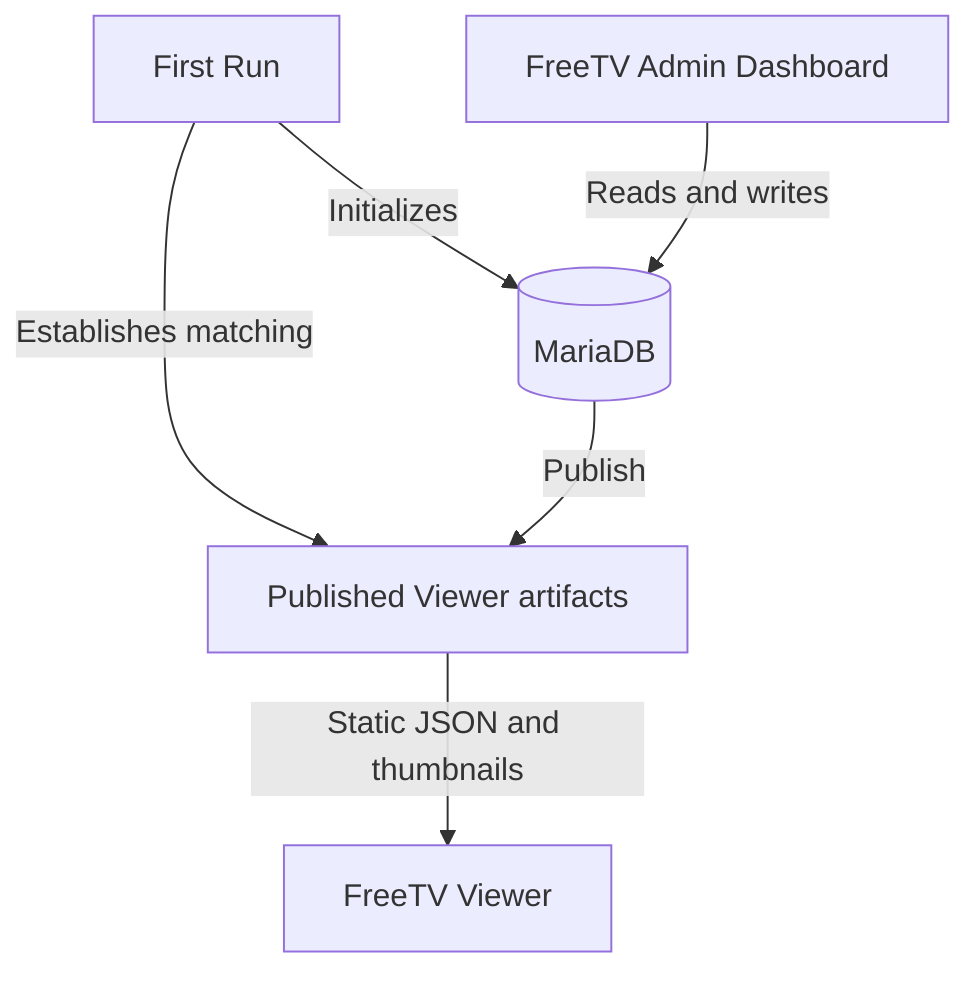

# FreeTV Admin Dashboard

 FreeTV Admin Dashboard is a backend interface for managing hand-picked video content which is hosted on the Internet Archive. It works in conjunction with the FreeTV Viewer which displays this content for the end user. The show data is stored in a MariaDB database and exported via a publishing process to be consumed by the FreeTV Viewer. 

The FreeTV Admin Dashboard allows administrators to add new shows and playlists, edit existing shows and playlists, add/edit thumbnail images, and publish Viewer-compatible JSON artifacts. 

<div style="text-align: center; margin-top: 30px;">
<a href="public/assets/freetv-admin-screenshot.jpg" target="_blank" title="Screenshot of FreeTV Admin Dashboard"></a>
</div>

## Features

- Foo
- Bar
- Baz
- Bat
- Quux

## Requirements

### System Requirements

- Node.js 22 or newer
- npm
- PHP 8.4.1 or newer
- Composer
- MariaDB
- A modern web browser

### Required PHP Extensions

- cURL
- Imagick
- PDO
- PDO MySQL
- ZIP

The PHP process must also have permission to write to the configured public directory and the repository’s `temp/` directories.

Frontend dependencies—including Preact, Vite, and Bootstrap-related integration—are managed by the project. PHP dependencies—including Illuminate Database and PHP dotenv—are installed through Composer.

<br/>

# How do I ...  ?

The FreeTV project consists of several repositories that can be run independently or together. The tables below provide a quick reference for common development, data, build, and deployment tasks.

## FreeTV Admin Dashboard

| I want to... | What do I do? | What happens? |
| --- | --- | --- |
| **Run only the Admin Dashboard locally** | In a terminal, navigate to `freetv-server/public`. Start a PHP development server with `php -S localhost:8081`. Then open a **new terminal or terminal tab**, navigate to `freetv-server/`, and run `npm run dev`. The PHP and Vite development servers must both be running simultaneously. | Starts the PHP API on port `8081` and the Admin Dashboard using the default Vite development server port. Vite displays the local URL when it starts. |
| **Initialize a new FreeTV installation** | Start the Admin Dashboard and follow the First Run process in the browser. | Checks database readiness and allows the installation to be initialized using Start Fresh, Baseline Sample Data, Current Sample Data, or Current Official Data. Successful initialization returns you to the login screen. |
| **Publish database changes for the Viewer** | Use the **Publish** page in the Admin Dashboard. | Converts the current MariaDB-backed Admin data into Viewer-compatible static artifacts in the configured public directory. |
| **Undo the last publication** | Use the **Undo** action on the Publish page. | Restores the previous published Viewer artifacts when an undo point is available. |
| **Build only the Admin frontend** | Navigate to `freetv-server/` and run `npm run build`. | Builds and validates the Admin Dashboard production frontend. It does not create a complete FreeTV production assembly. |
| **Configure a custom public directory** | Set `FREETV_PUBLIC_PATH` in the Admin runtime environment. | Changes the filesystem directory used for public Viewer artifacts. |

## FreeTV Viewer

| I want to... | What do I do? | What happens? |
| --- | --- | --- |
| **Run, build, or modify the Viewer** | See the [FreeTV Viewer documentation](https://github.com/freetv-today/freetv-viewer). | Explains Viewer development, data sources, builds, and deployment. |

## FreeTV Data

| I want to... | What do I do? | What happens? |
| --- | --- | --- |
| **Understand the distributed FreeTV data** | See the [FreeTV Data documentation](https://github.com/freetv-today/freetv-data). | Explains published Viewer artifacts, thumbnails, SQL packages, datasets, releases, and integrity manifests. |

## FreeTV Tooling

| I want to... | What do I do? | What happens? |
| --- | --- | --- |
| **Run all repositories together** | See the [FreeTV Tooling documentation](https://github.com/freetv-today/freetv-tooling). | Explains the coordinated development environment and repository configuration. |
| **Build or verify a complete production assembly** | See the [FreeTV Tooling documentation](https://github.com/freetv-today/freetv-tooling). | Explains cross-repository builds, assembly, verification, and production output. |

## Production / Deployment

| I want to... | What do I do? | What happens? |
| --- | --- | --- |
| **Build or deploy a complete FreeTV installation** | See the production documentation in [FreeTV Tooling](https://github.com/freetv-today/freetv-tooling). | Explains how the repositories are assembled and prepared for deployment. Tooling does not automatically upload or deploy the result. |

# Architecture

The FreeTV Admin Dashboard is divided into a browser frontend and a PHP backend. The frontend is a Preact single-page application built with Vite and styled with Bootstrap. It communicates with JSON API endpoints implemented in PHP under `public/api/`.

The PHP application loads private runtime configuration through PHP dotenv and uses the Illuminate Database component to communicate with MariaDB. MariaDB stores authoritative Admin data, while the filesystem holds published Viewer artifacts, thumbnails, and temporary recovery state.

## Data Flow


MariaDB is the authoritative source for data managed through the FreeTV Admin Dashboard. The Viewer does not read directly from MariaDB. Instead, the Admin publication process generates static JSON and thumbnail artifacts that the Viewer consumes.

First Run establishes both sides of this relationship. It initializes MariaDB and establishes the corresponding Viewer artifacts using the selected initialization mode. Because the database and Viewer artifacts represent the same initial state, a successful First Run leaves the Publish page clean.

After initialization, changes made through the Admin affect MariaDB first. They become visible to the Viewer only after they are published.

## Repository Relationships

The FreeTV repositories have separate responsibilities:

| Repository | Responsibility |
| --- | --- |
| [`freetv-server`](https://github.com/freetv-today/freetv-server) | Provides the FreeTV Admin Dashboard, PHP API, MariaDB-backed management system, First Run process, and publication system. |
| [`freetv-viewer`](https://github.com/freetv-today/freetv-viewer) | Provides the end-user application that consumes published static Viewer artifacts. |
| [`freetv-data`](https://github.com/freetv-today/freetv-data) | Stores the official distributable datasets, Viewer artifacts, SQL packages, release packages, and integrity metadata. |
| [`freetv-tooling`](https://github.com/freetv-today/freetv-tooling) | Coordinates cross-repository development, validation, builds, data workflows, and production assembly. |

The repositories can be developed independently when appropriate. Tasks that cross repository boundaries—such as running the complete development environment or building a production assembly—are owned by `freetv-tooling`.

## Project Structure

The following tree highlights the directories and files most relevant to installing, developing, publishing, and maintaining the Admin Dashboard. It does not list every source file or API endpoint.

```text
freetv-server/
├── public/
│   ├── api/
│   │   └── admin/          Admin API endpoints and backend services
│   └── assets/             Admin Dashboard images and static assets
├── resources/
│   ├── bootstrap/          First Run bootstrap resources
│   └── freetv-baseline-sample-data.zip
│                           Bundled offline Baseline Sample Data
├── scripts/                Repository maintenance and validation scripts
├── sql/                    Generated MariaDB schema and dataset packages
├── src/
│   ├── components/         Reusable Admin Dashboard components
│   ├── context/            Admin session and application context
│   ├── hooks/              Frontend data and behavior hooks
│   ├── pages/              Admin Dashboard pages
│   ├── signals/            Shared reactive state
│   └── utils/              Frontend utilities
├── temp/
│   ├── data-snapshots/     Optional Data Snapshot working files
│   ├── publication-undo/   Publication rollback state
│   ├── thumbnail-quarantine/
│   └── thumbnail-undo/     Thumbnail recovery state
├── tests/                  PHP and JavaScript contract tests
├── tools/                  Export and SQL-package tools used by Tooling
├── .env.example            PHP runtime configuration template
├── .env.development        Vite frontend development configuration
├── .env.production         Vite frontend production configuration
├── composer.json           PHP dependencies
├── package.json            Frontend commands and dependencies
└── vite.config.js          Admin Dashboard Vite configuration
```

# Development


# License

This code is released under the [GPL v3](LICENSE) license.