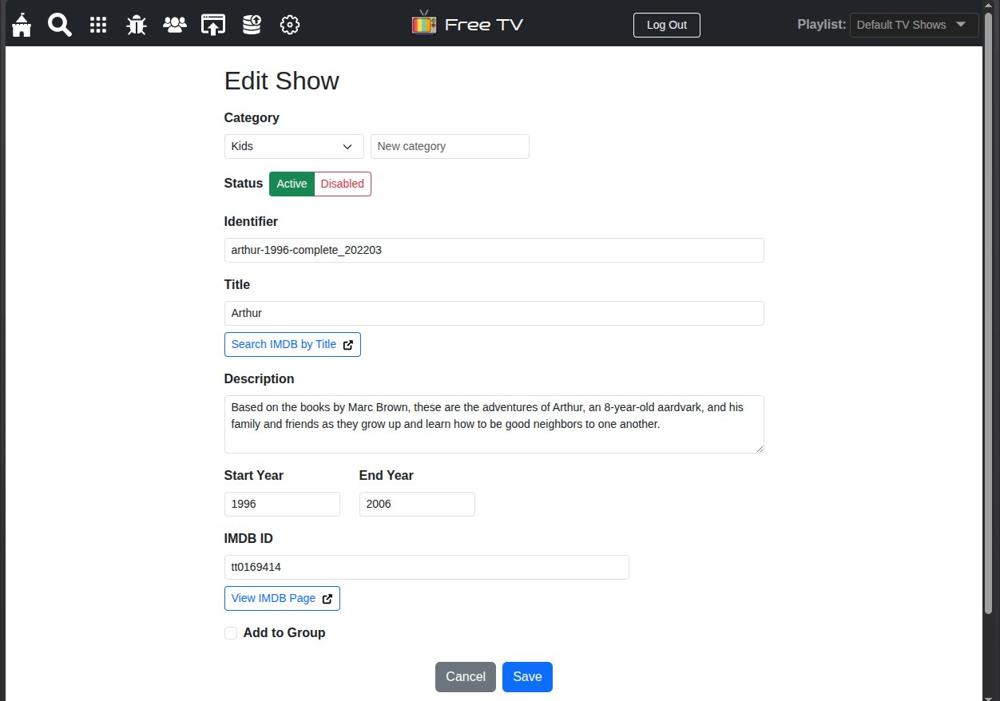
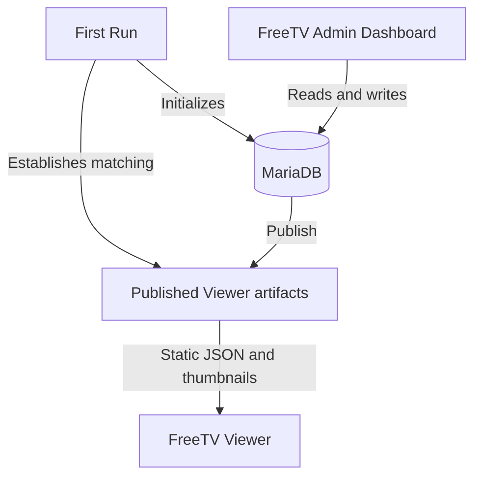

# FreeTV Admin Dashboard

 FreeTV Admin Dashboard is a backend interface for managing hand-picked video content which is hosted on the Internet Archive. It works in conjunction with the FreeTV Viewer which displays this content for the end user. The show data is stored in a MariaDB database and exported via a publishing process to be consumed by the FreeTV Viewer. 

The FreeTV Admin Dashboard allows administrators to add new shows and playlists, edit existing shows and playlists, add/edit thumbnail images, and publish Viewer-compatible JSON artifacts. 

<div style="text-align: center; margin-top: 30px;">
<a href="public/assets/freetv-admin-screenshot.jpg" target="_blank" title="Screenshot of FreeTV Admin Dashboard"></a>
</div>

## Features

- Foo
- Bar
- Baz
- Bat
- Quux

## Requirements

### System Requirements

- Node.js 22 or newer
- npm
- PHP 8.4.1 or newer
- Composer
- MariaDB
- A modern web browser

### Required PHP Extensions

- cURL
- Imagick
- PDO
- PDO MySQL
- ZIP

The PHP process must also have permission to write to the configured public directory and the repository’s `temp/` directories.

Frontend dependencies, including Preact, Vite, and Bootstrap, are installed through npm. PHP dependencies, including Illuminate Database and PHP dotenv, are installed through Composer.

## Getting Started

1. Clone or download `freetv-server`.
2. Navigate to the `freetv-server` directory and run `npm install`.
3. From the same directory, run `composer install`.
4. Create `.env` from `.env.example`.
5. Enter your MariaDB credentials. The configured account must be able to either:
    - create the configured database, or
    - use an existing database and create tables within it.
6. In a terminal, navigate to `freetv-server/public`. Start the PHP development server with `php -S localhost:8081`.
7. Open a **new terminal or terminal tab**, navigate to `freetv-server/`, and run `npm run dev`. The PHP and Vite development servers must both remain running.
8. Open the local URL printed by Vite in your browser.
9. Complete First Run to initialize the database, establish the matching Viewer artifacts, and create the first Administrator account.
10. Log in to the FreeTV Admin Dashboard using the account you created during First Run.

# How do I ...  ?

The FreeTV project consists of several repositories that can be run independently or together. The tables below provide a quick reference for common development, data, build, and deployment tasks.

## FreeTV Admin Dashboard

| I want to... | What do I do? | What happens? |
| --- | --- | --- |
| **Run only the Admin Dashboard locally** | In a terminal, navigate to `freetv-server/public`. Start a PHP development server with `php -S localhost:8081`. Then open a **new terminal or terminal tab**, navigate to `freetv-server/`, and run `npm run dev`. The PHP and Vite development servers must both be running simultaneously. | Starts the PHP API on port `8081` and the Admin Dashboard using the default Vite development server port. Vite displays the local URL when it starts. |
| **Initialize a new FreeTV installation** | Start the Admin Dashboard and follow the First Run process in the browser. | Checks database readiness and allows the installation to be initialized using Start Fresh, Baseline Sample Data, Current Sample Data, or Current Official Data. Successful initialization returns you to the login screen. |
| **Publish database changes for the Viewer** | Use the **Publish** page in the Admin Dashboard. | Converts the current MariaDB-backed Admin data into Viewer-compatible static artifacts in the configured public directory. |
| **Undo the last publication** | Use the **Undo** action on the Publish page. | Restores the previous published Viewer artifacts when an undo point is available. |
| **Build only the Admin frontend** | Navigate to `freetv-server/` and run `npm run build`. | Builds and validates the Admin Dashboard production frontend. It does not create a complete FreeTV production assembly. |
| **Configure a custom public directory** | Set `FREETV_PUBLIC_PATH` in the Admin runtime environment. | Changes the filesystem directory used for public Viewer artifacts. |

## FreeTV Viewer

| I want to... | What do I do? | What happens? |
| --- | --- | --- |
| **Run, build, or modify the Viewer** | See the [FreeTV Viewer documentation](https://github.com/freetv-today/freetv-viewer). | Explains Viewer development, data sources, builds, and deployment. |

## FreeTV Data

| I want to... | What do I do? | What happens? |
| --- | --- | --- |
| **Understand the distributed FreeTV data** | See the [FreeTV Data documentation](https://github.com/freetv-today/freetv-data). | Explains published Viewer artifacts, thumbnails, SQL packages, datasets, releases, and integrity manifests. |

## FreeTV Tooling

| I want to... | What do I do? | What happens? |
| --- | --- | --- |
| **Run all repositories together** | See the [FreeTV Tooling documentation](https://github.com/freetv-today/freetv-tooling). | Explains the coordinated development environment and repository configuration. |
| **Build or verify a complete production assembly** | See the [FreeTV Tooling documentation](https://github.com/freetv-today/freetv-tooling). | Explains cross-repository builds, assembly, verification, and production output. |

## Production / Deployment

| I want to... | What do I do? | What happens? |
| --- | --- | --- |
| **Build or deploy a complete FreeTV installation** | See the production documentation in [FreeTV Tooling](https://github.com/freetv-today/freetv-tooling). | Explains how the repositories are assembled and prepared for deployment. Tooling does not automatically upload or deploy the result. |

# Architecture

The FreeTV Admin Dashboard is divided into a browser frontend and a PHP backend. The frontend is a Preact single-page application built with Vite and styled with Bootstrap. It communicates with JSON API endpoints implemented in PHP under `public/api/`.

The PHP application loads private runtime configuration through PHP dotenv and uses the Illuminate Database component to communicate with MariaDB. MariaDB stores authoritative Admin data, while the filesystem holds published Viewer artifacts, thumbnails, and temporary recovery state.

## Data Flow


MariaDB is the authoritative source for data managed through the FreeTV Admin Dashboard. The Viewer does not read directly from MariaDB. Instead, the Admin publication process generates static JSON and thumbnail artifacts that the Viewer consumes.

First Run establishes both sides of this relationship. It initializes MariaDB and establishes the corresponding Viewer artifacts using the selected initialization mode. Because the database and Viewer artifacts represent the same initial state, a successful First Run leaves the Publish page clean.

After initialization, changes made through the Admin affect MariaDB first. They become visible to the Viewer only after they are published.

## Repository Relationships

The FreeTV repositories have separate responsibilities:

| Repository | Responsibility |
| --- | --- |
| [`freetv-server`](https://github.com/freetv-today/freetv-server) | Provides the FreeTV Admin Dashboard, PHP API, MariaDB-backed management system, First Run process, and publication system. |
| [`freetv-viewer`](https://github.com/freetv-today/freetv-viewer) | Provides the end-user application that consumes published static Viewer artifacts. |
| [`freetv-data`](https://github.com/freetv-today/freetv-data) | Stores the official distributable datasets, Viewer artifacts, SQL packages, release packages, and integrity metadata. |
| [`freetv-tooling`](https://github.com/freetv-today/freetv-tooling) | Coordinates cross-repository development, validation, builds, data workflows, and production assembly. |

The repositories can be developed independently when appropriate. Tasks that cross repository boundaries—such as running the complete development environment or building a production assembly—are owned by `freetv-tooling`.

## Project Structure

The following tree highlights the directories and files most relevant to installing, developing, publishing, and maintaining the Admin Dashboard. It does not list every source file or API endpoint.

```text
freetv-server/
├── public/
│   ├── api/
│   │   └── admin/          Admin API endpoints and backend services
│   └── assets/             Admin Dashboard images and static assets
├── resources/
│   ├── bootstrap/          First Run bootstrap resources
│   └── freetv-baseline-sample-data.zip
│                           Bundled offline Baseline Sample Data
├── scripts/                Repository maintenance and validation scripts
├── sql/                    Generated MariaDB schema and dataset packages
├── src/
│   ├── components/         Reusable Admin Dashboard components
│   ├── context/            Admin session and application context
│   ├── hooks/              Frontend data and behavior hooks
│   ├── pages/              Admin Dashboard pages
│   ├── signals/            Shared reactive state
│   └── utils/              Frontend utilities
├── temp/
│   ├── data-snapshots/     Optional Data Snapshot working files
│   ├── publication-undo/   Publication rollback state
│   ├── thumbnail-quarantine/
│   └── thumbnail-undo/     Thumbnail recovery state
├── tests/                  PHP and JavaScript contract tests
├── tools/                  Export and SQL-package tools used by Tooling
├── .env.example            PHP runtime configuration template
├── .env.development        Vite frontend development configuration
├── .env.production         Vite frontend production configuration
├── composer.json           PHP dependencies
├── package.json            Frontend commands and dependencies
└── vite.config.js          Admin Dashboard Vite configuration
```

# Development

This section describes developing `freetv-server` as a standalone FreeTV Admin Dashboard. Local development requires MariaDB, the PHP backend, and the Vite frontend to run together. The Viewer is not required for ordinary Admin development, although published Viewer artifacts can be inspected in the configured public directory.

For coordinated development across the Admin Dashboard, Viewer, and Data repositories, see the [FreeTV Tooling documentation](https://github.com/freetv-today/freetv-tooling).

## Database and Runtime Configuration

The PHP backend reads its runtime configuration from `.env` in the `freetv-server` root directory. Create this file from `.env.example`. The file may contain database credentials and must not be committed to source control.

| Variable | Required? | Purpose |
| --- | --- | --- |
| `DB_HOST` | Yes | Hostname or IP address of the MariaDB server. |
| `DB_PORT` | No | MariaDB port. Defaults to `3306` when omitted or empty. Valid values are `1` through `65535`. |
| `DB_NAME` | Yes | Name of the database used by FreeTV. |
| `DB_USER` | Yes | MariaDB account used by the PHP backend. |
| `DB_PASS` | No | Password for the configured MariaDB account. May be empty when the account does not require one. |
| `FREETV_PUBLIC_PATH` | No | Safe relative path where public Viewer artifacts and thumbnails are stored. Defaults to `public`, matching the repository’s local development and production-assembly layout. Hosting environments may use a different web-root directory, such as `public_html`. |

A typical local configuration is:

```dotenv
DB_HOST=127.0.0.1
DB_PORT=3306
DB_NAME=freetv
DB_USER=user
DB_PASS=<password>
FREETV_PUBLIC_PATH=public
```

`FREETV_PUBLIC_PATH` is resolved relative to the private application root and must remain inside it. Absolute paths and path traversal segments such as `..` are rejected. For shared hosting, a value such as `public_html` can identify the web-root directory located alongside the application’s private runtime files. Example:

```text
private-application-root/
├── .env
├── composer.json
├── composer.lock
├── public_html/
├── temp/
└── vendor/
```

### MariaDB Permissions

First Run supports two database permission models:

- **Create-database mode:** The configured account can create and use the database named by `DB_NAME`.
- **Existing-database mode:** The database already exists and the configured account can create, read, write, and remove tables within it.

During readiness checking, FreeTV performs temporary database or table operations to determine which mode is available. The temporary objects are removed after the check.

**FreeTV does not install MariaDB or create database accounts.**

For installation instructions, see the [MariaDB Server installation guide](https://mariadb.com/docs/server/mariadb-quickstart-guides/installing-mariadb-server-guide). For database accounts and privileges, follow the MariaDB documentation or the instructions provided by your hosting provider.

When using existing-database mode, create the database and grant the required permissions before starting First Run.

## Local Admin Development

Standalone Admin development uses two processes:

- a PHP development server for the API and public Viewer artifacts;
- a Vite development server for the Preact frontend.

MariaDB must also be running and accessible using the credentials in `.env`.

### Start the PHP Backend

In a terminal, navigate to `freetv-server/public` and run:

```bash
php -S localhost:8081
```

This starts the PHP backend at `http://localhost:8081`. The `public/` directory acts as the local PHP document root.

### Start the Vite Frontend

Open a new terminal or terminal tab, navigate to `freetv-server/`, and run:

```bash
npm run dev
```

Vite starts the Admin frontend and displays its local URL. Keep both the PHP and Vite development servers running while using the Admin Dashboard.

During standalone development, Vite proxies requests beginning with `/api` to:

```text
http://localhost:8081
```

### Use a Different PHP Port

If the PHP backend must use a different port, start PHP with that port and set `VITE_API_PROXY_TARGET` to the matching URL.

For example, start PHP with:

```bash
php -S localhost:8082
```

Then create `.env.development.local` in `freetv-server/` containing:

```dotenv
VITE_API_PROXY_TARGET=http://localhost:8082
```

Restart Vite after changing its environment configuration.

`VITE_API_PROXY_TARGET` affects only the Vite development proxy. It does not configure MariaDB or the PHP runtime.

## First Run

First Run appears when FreeTV can connect to MariaDB but the installation has not yet been initialized. It prepares the database, establishes the corresponding Viewer artifacts, and creates the first Administrator account.

Before displaying the initialization options, FreeTV checks that:

- the required PHP dependencies are available;
- the MariaDB configuration is present and usable;
- the configured database account has sufficient permissions; and
- the installation does not already contain an Administrator account.

### Initialization Modes

| Mode | Data source | Result |
| --- | --- | --- |
| **Start Fresh** | Generated locally | Creates one empty default playlist named **Playlist One** without adding any shows. |
| **Baseline Sample Data** | Bundled with `freetv-server` | Installs a small sample library without downloading a dataset. |
| **Current Sample Data** | Downloaded from the FreeTV dataset service | Installs the current sample library and its matching Viewer artifacts. An Internet connection is required. |
| **Current Official Data** | Downloaded from the FreeTV dataset service | Installs the current complete FreeTV library and its matching Viewer artifacts. An Internet connection is required. |

Every mode asks you to create the first Administrator username and password. Usernames may contain letters, numbers, dots, dashes, and underscores. Passwords must contain at least six characters.

For downloaded datasets, FreeTV retrieves the current package information, verifies the downloaded archive and package contents, and installs the database data and Viewer artifacts together. If retrieval or verification fails, initialization is not completed and the Administrator account is not created.

After successful initialization, FreeTV returns you to the login screen. Log in using the Administrator account you created.

The initial MariaDB data and published Viewer artifacts represent the same state, so the Publish page is initially clean. Later Admin changes affect MariaDB first and must be published before they appear in the Viewer.

First Run is only for an uninitialized installation. It is not a database reset or data-import workflow and is no longer available after initialization has completed.

## Build the Admin Frontend

To create and validate the standalone Admin production frontend, navigate to `freetv-server/` and run:

```bash
npm run build
```

The build is written to `dist/` and validated by the repository’s Admin distribution contract. This frontend-only build is not a complete deployable FreeTV production assembly. Use [`freetv-tooling`](https://github.com/freetv-today/freetv-tooling) to build the complete deployable FreeTV site. Tooling combines the Viewer frontend, Admin Dashboard, PHP API and runtime dependencies, and the current published JSON and thumbnails into one verified production assembly.

# License

This code is released under the [GPL v3](LICENSE) license.